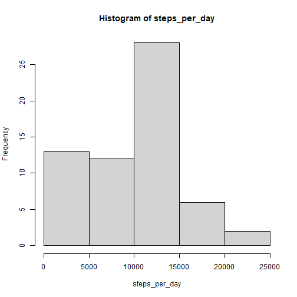
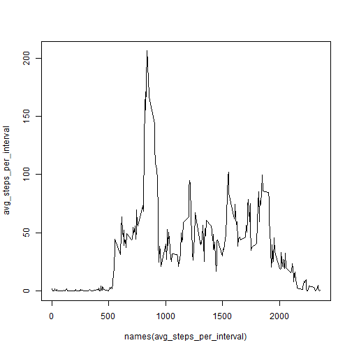
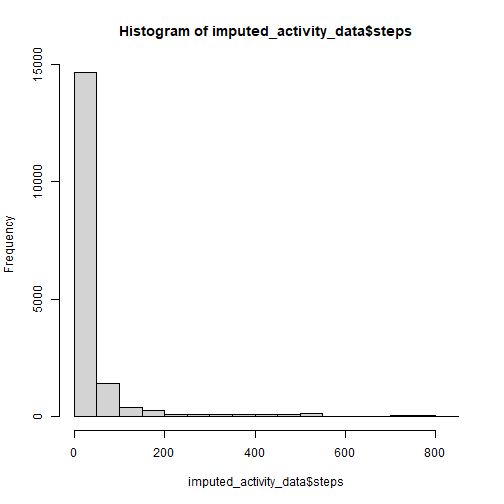
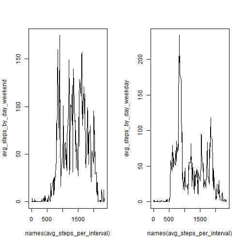

# Course Project 1

## Loading and preprocessing the data

``` r
activity_data = read.csv('activity.csv')
```

## What is the mean total number of steps taken per day?

``` r
days_factor = factor(activity_data$date)
steps_per_day = tapply(activity_data$steps, days_factor, sum, na.rm=T)
hist(steps_per_day)
```



``` r
mean(steps_per_day)
```

```
## [1] 9354.23
```

``` r
median(steps_per_day)
```

```
## [1] 10395
```

## What is the average daily activity pattern?

``` r
interval_factor = factor(activity_data$interval)
avg_steps_per_interval = tapply(activity_data$steps, interval_factor, mean, na.rm=T)
plot(names(avg_steps_per_interval), avg_steps_per_interval, type='l')
```



Which 5-minute interval, on average across all the days in the dataset, contains the maximum number of steps?

``` r
names(avg_steps_per_interval)[which.max(avg_steps_per_interval)]
```

```
## [1] "835"
```

## Imputing missing values

``` r
missing_steps_rows = sum(is.na(activity_data$steps))
```

Missing data is replaced by the average steps for the associated interval.

``` r
library(stringr)
is_na_idx = which(is.na(activity_data$steps))
imputed_activity_data = activity_data
imputed_activity_data$steps = as.numeric(apply(activity_data, MARGIN=1,
  FUN = function(r) {
    if (is.na(r['steps'])) {
      avg_steps_per_interval[str_trim(
        as.character(r['interval']))] # Use the mean for that interval
    } else {
      r['steps']
    }
  }))
```


``` r
hist(imputed_activity_data$steps)
```



``` r
mean(imputed_activity_data$steps)
```

```
## [1] 37.3826
```

``` r
median(imputed_activity_data$steps)
```

```
## [1] 0
```

## Are there differences in activity patterns between weekdays and weekends?

``` r
activity_data$day_type = sapply(activity_data$date, function(r) {
  if (weekdays(as.Date(r)) %in% c("Saturday", "Sunday")) {
    "weekend"
  } else {
    "weekday"
  }
})
day_type_factor = factor(activity_data$day_type)
weekend_data = subset(activity_data, day_type=='weekend')
weekday_data = subset(activity_data, day_type=='weekday')
avg_steps_by_day_weekend = tapply(weekend_data$steps, 
  interval_factor[activity_data$day_type == 'weekend'],
  mean, na.rm=T)
avg_steps_by_day_weekday = tapply(weekday_data$steps,
  interval_factor[activity_data$day_type == 'weekday'],
  mean, na.rm=T)
par(mfrow=c(1,2))
plot(names(avg_steps_per_interval), avg_steps_by_day_weekend, type='l')
plot(names(avg_steps_per_interval), avg_steps_by_day_weekday, type='l')
```


